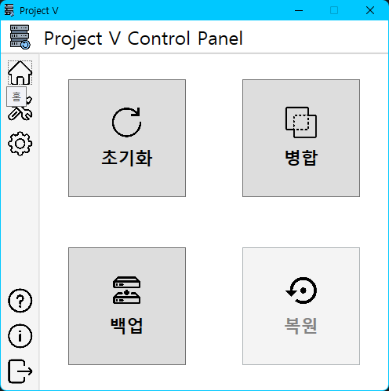
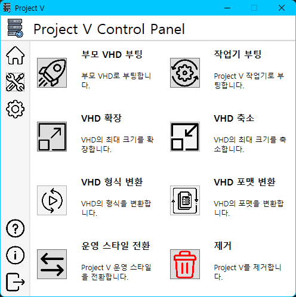
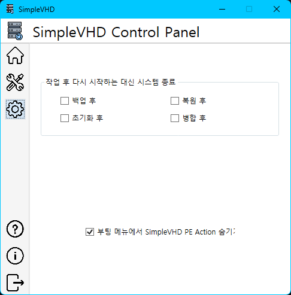

# Project V 설명서
이 설명서에서는 Project V를 사용하는데 필요한 모든 것을 설명합니다.

## 설치하기 전에
1. Project V는 VHD에 설치된 **단 하나**의 윈도우만 관리할 수 있습니다. 여러 개의 VHD를 관리할 수 없습니다.
1. .NET Framework 4.0 또는 그 이상 버전이 설치되어 있어야 합니다.
   1. 윈도우 8 이상에는 .NET Framework 4.0 또는 그 이상 버전이 기본으로 설치되어 있습니다.
   1. 윈도우 7에는 .NET Framework 4.0 또는 그 이상 버전이 기본으로 설치되어 있지 않습니다. 알아서 설치하시기 바랍니다.
   1. .NET Core나 .NET 5 또는 그 이상 버전이 **아닙니다**!
1. 반드시 설치할 VHD로 부팅하셔서 설치를 진행해야 합니다.
1. 사용자 계정 컨트롤은 끄는 것을 권장합니다. 켜놔도 별 상관은 없지만 부팅할 때 마다 Project V Agent라는 프로그램의 실행을 허가해줘야 합니다.

## 설치
1. 압축 파일을 다운받고 압축을 풉니다. **드라이브 루트에 정확히 "ProjectV" 라는 폴더가 보이게끔 풀어야 합니다.**
1. Bin 폴더 안에 들어있는 Installer.exe 파일을 실행합니다.
1. 절차에 따릅니다. 시스템이 재부팅됩니다.
1. 설치 완료 후 취향에 따라 바탕 화면에 Control.exe의 바로 가기를 만드세요.

## 사용
Project V 제어판(Control.exe)으로 작업을 수행할 수 있습니다. 메뉴는 세 가지로 나뉩니다.

### 홈

홈 메뉴에서는 가장 자주 사용되는 네 가지 메뉴를 사용할 수 있습니다.

1. 초기화 (차등 스타일에서만)
1. 병합 (차등 스타일에서만)
1. 백업
1. 복원

### 도구

도구 메뉴에서는 기타 여러 가지 기능들에 접근할 수 있습니다.

1. 부모 VHD 부팅
1. 작업기 부팅
1. VHD 형식 / 포맷 변환
1. 운영 스타일 전환
1. Project V 제거

### 옵션

옵션 메뉴에서는 프로그램의 옵션을 조절할 수 있습니다.

## 스타일 소개
### 단순 스타일
단순 스타일은 VHD를 통채로 백업하고 복원하는 스타일입니다. 통채로 백업하기 때문에 시간이 오래 걸립니다.

자주 복원하지 않고 문제가 생겼을때만 복원하시는 분들에게 추천합니다.

### 차등 스타일
차등 스타일은 **자식 VHD**라고도 하는 차이점 보관 VHD(Differencing VHD)를 이용합니다. 원본 VHD는 건드리지 않은채 차이점 보관 VHD를 만들어 사용합니다.

필요하면 언제든 이 파일을 "초기화"함으로써 빠르게 이전 상태로 되돌아갈 수 있지만 원본과 차이 VHD 두 파일을 사용하기 때문에 그만큼 용량을 더 차지한다는 단점이 있습니다.

차등 스타일은 또 **수동 초기화**와 **자동 초기화**로 나뉘는데 수동 초기화는 말 그대로 필요할 때마다 수동으로 초기화 하는 방식이고 자동 초기화는 부팅할 때 마다 다른 VHD로 부팅하여 자동으로 다른 VHD를 초기화하는 방식입니다.

## 작업 소개
### 백업
백업 작업은 전체 VHD를 통채로 백업합니다. 전체를 백업하기 때문에 용량이 크고, 시간도 오래 걸립니다.

### 복원
복원 작업은 통채로 백업한 VHD를 복원합니다. 전체를 복원하기 때문에 시간이 오래 걸립니다.

### 초기화
초기화는 차등 스타일에서만 사용할 수 있으며, 자식 VHD를 깨끗하게 초기화합니다.

### 병합
병합은 차등 스타일에서만 사용할 수 있으며, 자식 VHD의 변경 사항을 부모(원본) VHD에 적용합니다.

## 버그 제보하기
추가 예정
